# Architecture

This page explains how `tanstack-router-cache` is built: runtime pieces, state shape, rendering flow, eviction, events, and memory behavior.

## Quick map

`tanstack-router-cache` replaces the normal TanStack Router outlet area with a cache manager. The live route still comes from TanStack Router. Cacheable route trees are captured after they become ready, then rendered from a stored router snapshot when they should stay mounted.

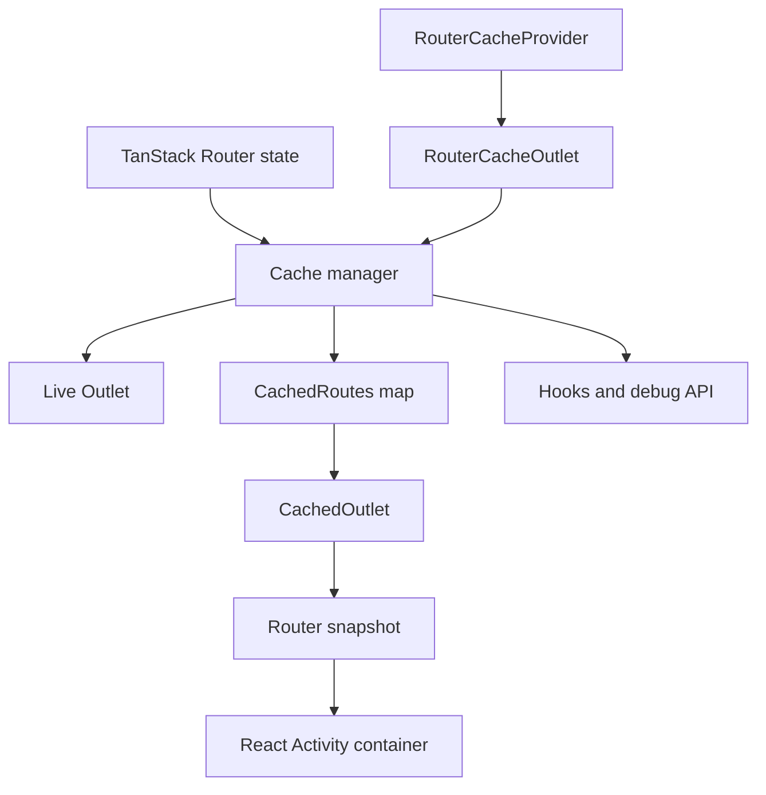

## Runtime pieces

| Piece | Responsibility |
| --- | --- |
| `RouterCacheProvider` | Owns cache state, cache limits, scope resets, and errored-route tracking. |
| `RouterCacheOutlet` | Replaces TanStack Router's outlet for the route branch that can be cached. |
| Cache manager | Reads live router state, decides whether to render the live outlet or cached outlets, and synchronizes cache entries. |
| `CachedOutlet` | Renders a cached route from a stored router snapshot and match id. |
| `OffScreen` | Wraps cached route content in React `Activity` and marks the route as `visible` or `hidden`. |
| Event listener | Emits route activity and cached-navigation lifecycle events used by hooks. |
| Debug hook | Exposes development diagnostics on `window.__TANSTACK_ROUTER_CACHE_DEBUG__`. |
| Transient UI tracker | Tracks external UI added outside the route container and hides or restores it with the owning route. |

## Route lifecycle

A route becomes cacheable only after the current match is resolved, successful, and marked with `staticData.routeCache: true`.

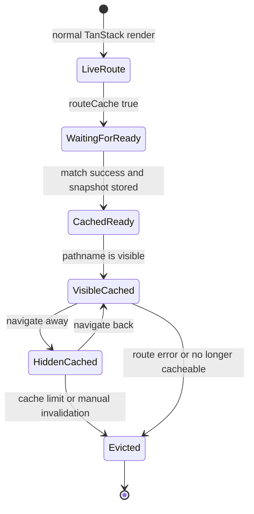

In normal usage, a cached route alternates between `visible` and `hidden`. It leaves the cache when a limit evicts it, the app invalidates it, the route stops being cacheable, or an error boundary marks it as failed.

## Provider state

The provider stores cached routes by normalized pathname. The same object is exposed publicly as `cachedRoutes`.

```ts
type CachedRoutes = {
  [normalizedPathname: string]: CachedRouteData;
};

type ErroredRouteCounts = Record<string, number>;
```

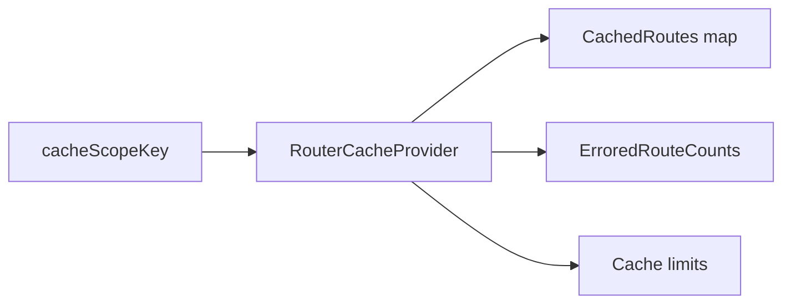

`ErroredRouteCounts` prevents failed cached views from being reused while an error fallback is mounted. It is count-based so repeated error-boundary hooks can retain and release the same pathname safely.

The provider exposes these operations to the cache manager and hooks:

| Operation | Purpose |
| --- | --- |
| Upsert cached route | Insert or update one cached route entry after normalizing the pathname. |
| Delete cached routes | Remove cached entries. Used by invalidation, errored routes, and cache manager cleanup. |
| Touch cached routes | Update `lastVisibleAt` when a cached route becomes visible. |
| Retain errored route | Mark a pathname as currently errored and remove its cached entry. |
| Release errored route | Release one error retain count for a pathname. |

## Cached route data

Each cache entry is small. The large memory cost is the retained React tree, not this data object.

```ts
type CachedRouteData = {
  createdAt?: number;
  href?: string;
  lastVisibleAt?: number;
  routeId?: string;
  staticData: StaticDataRouteOption;
  matchId?: string;
  routerSnapshot?: RouterSnapshot;
  ready?: boolean;
};
```

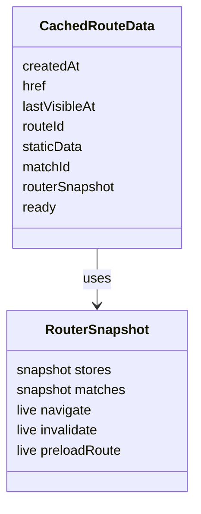

| Field | Role |
| --- | --- |
| `createdAt` | First time the entry was stored. Used as an eviction fallback. |
| `href` | Full route href, including search and hash when available. Used for restoration. |
| `lastVisibleAt` | Last time the entry became visible. Primary eviction timestamp. |
| `routeId` | TanStack route id. Used by `maxEntriesPerRouteId`. |
| `staticData` | Route static data. The route is cacheable when `routeCache` is `true`. |
| `matchId` | Match id used to render the cached route with TanStack Router's `Match`. |
| `routerSnapshot` | Router-like object with isolated snapshot stores used by the cached route tree. |
| `ready` | Marks that the route has a complete snapshot and can be rendered from cache. |

Pathnames are normalized by removing trailing slashes except for `/`, so `/customers/` and `/customers` share one cache key.

## Router snapshot

Cached route trees still expect TanStack Router context. Instead of connecting every cached tree directly to the live router stores, the package creates a router-like snapshot when a route becomes ready.

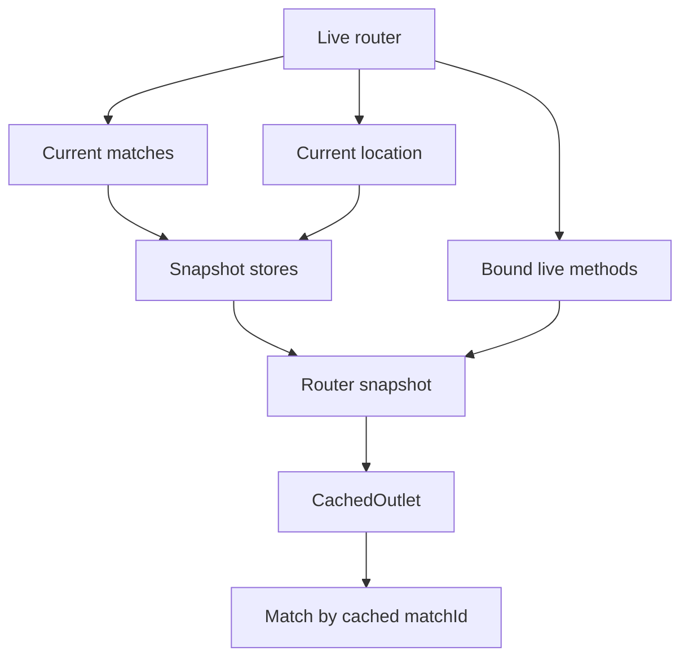

The snapshot owns isolated stores for the current matches, location, resolved location, and match stores. It also keeps selected live router methods bound to the real router, including `navigate`, `invalidate`, `preloadRoute`, and location builders.

When the cached entry is refreshed, the cache manager updates those snapshot stores in place. This lets route hooks read current match and search data without remounting the retained route tree. Imperative router actions still call through to the real router.

`CachedOutlet` renders that snapshot like this:

```tsx
<RouterContextProvider router={routerSnapshot}>
  <Match matchId={matchId} />
</RouterContextProvider>
```

## Cache synchronization

On every relevant router state change, the cache manager checks the current route state and updates the cache.

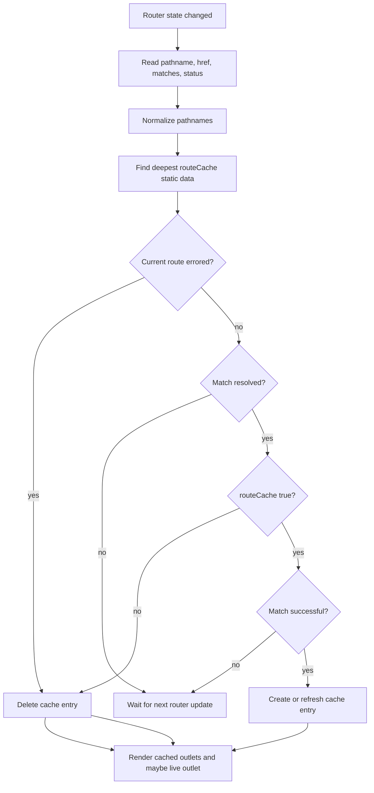

The current entry being written is protected during limit enforcement so the route that just became ready is not immediately evicted.

## Visible pathname

The manager tracks three pathnames:

| Name | Meaning |
| --- | --- |
| `routerPathname` | Current router location pathname. |
| `resolvedPathname` | Resolved router location pathname. |
| `visiblePathname` | Cached pathname that should currently be shown. |

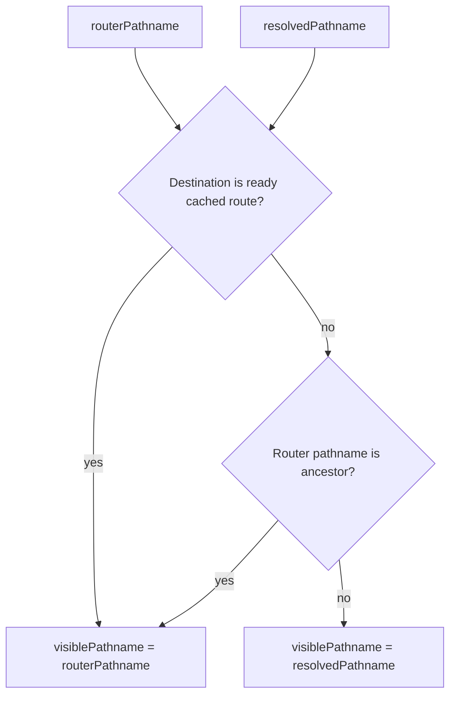

Most of the time, `visiblePathname` is the resolved pathname. During some navigations, TanStack Router can temporarily expose a router pathname that differs from the resolved pathname. If the destination is already cached, the package can show it immediately.

## Rendering model

Every ready cached entry is rendered through `OffScreen`.

```tsx
<OffScreen mode={visiblePathname === pathname ? "visible" : "hidden"}>
  <CachedOutlet matchId={route.matchId} routerSnapshot={route.routerSnapshot} />
</OffScreen>
```

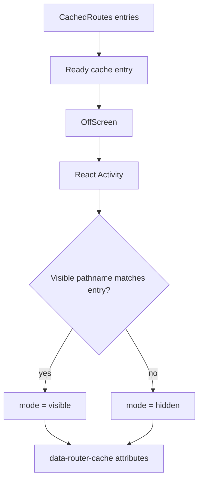

`OffScreen` uses React `Activity` with either `visible` or `hidden` mode. The route tree remains mounted in both modes. The wrapping element gets these attributes:

```html
<div
  data-router-cache-container="true"
  data-router-cache-mode="hidden"
  data-router-cache-pathname="/customers"
>
  ...
</div>
```

Those attributes are used by diagnostics and transient UI tracking.

## Scroll and transient UI

The hidden route container is not enough for every UI primitive. Popovers, menus, dialogs, tooltips, and command palettes often render into portals outside the route container.

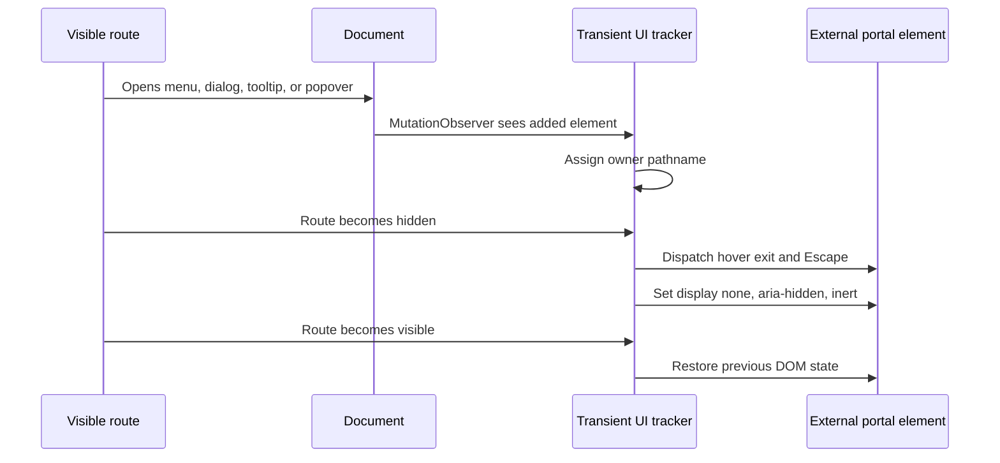

External elements can opt out of this ownership behavior with:

```html
<div data-router-cache-persistent-external="true">
  ...
</div>
```

The package also stores window scroll positions by pathname. When a cached route becomes visible, it restores the saved window scroll position after two animation frames.

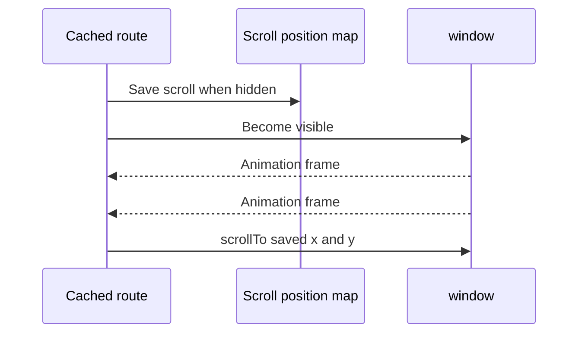

## Eviction

The provider accepts two limits:

| Limit | Meaning |
| --- | --- |
| `maxEntries` | Maximum cached entries in the provider. |
| `maxEntriesPerRouteId` | Maximum cached entries for the same TanStack route id. |

Invalid, missing, `NaN`, and non-finite limits are normalized to `Infinity`. Negative values are normalized to `0`. `maxEntries={0}` disables caching and clears existing entries.

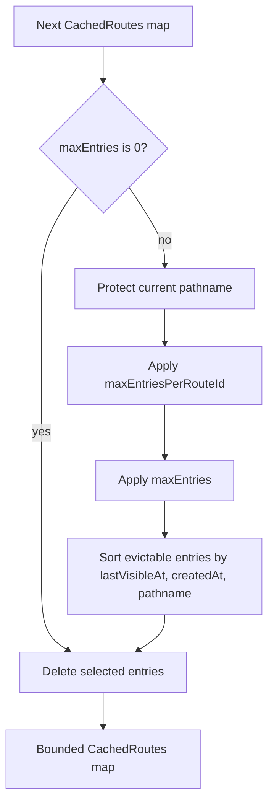

Limit enforcement runs in this order:

1. Apply `maxEntriesPerRouteId`.
2. Apply `maxEntries`.
3. Keep protected keys, usually the route currently being written.
4. Evict least recently visible entries first.
5. If timestamps tie, sort by pathname for deterministic eviction.

The timestamp used for eviction is `lastVisibleAt`, then `createdAt`, then `0`.

## Href restoration

The cache key is pathname-based, but a route can be cached with a fuller href that includes search params or a hash.

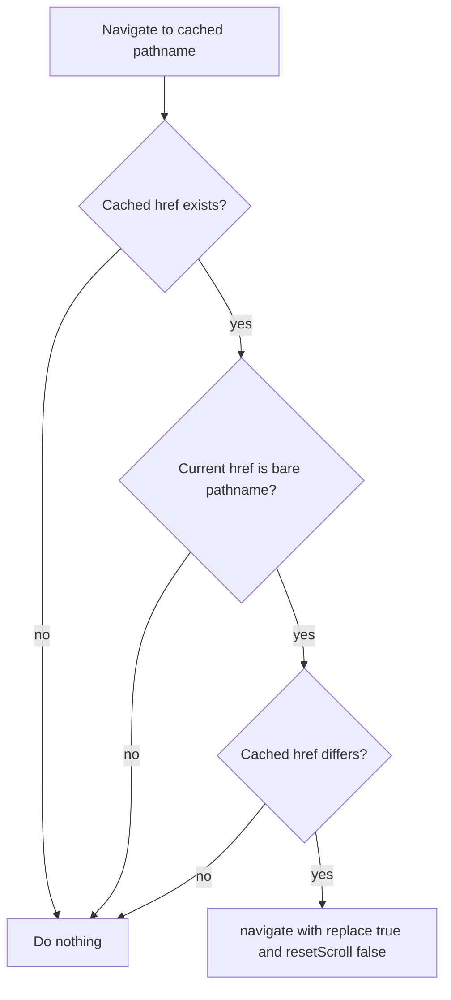

When restoration is needed, the package navigates back to the cached href:

```ts
router.navigate({
  href: cachedHref,
  replace: true,
  resetScroll: false,
});
```

This keeps cached list filters, tabs, anchors, or search state aligned with the retained route view.

## Events and hooks

The package uses a singleton internal event bus.

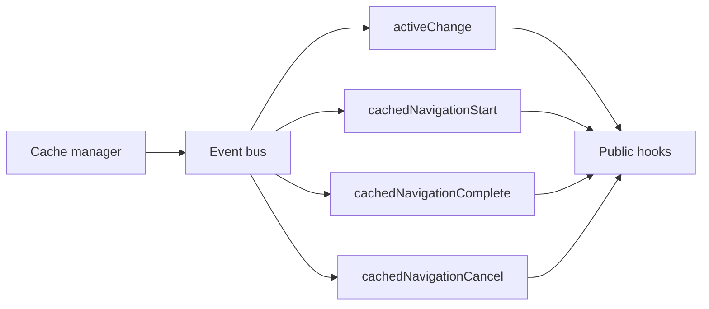

| Event | Payload | Used by |
| --- | --- | --- |
| `activeChange` | `{ pathname, mode }` | `useRouteCacheActive`, `useRouteCacheEffect`, `useRouteCacheActivity`, `useRouterCache` refreshes. |
| `cachedNavigationStart` | `{ pathname, startedAt }` | `useRouteCacheNavigation`. |
| `cachedNavigationComplete` | `{ pathname, startedAt, visibleAt, paintedAt, duration }` | `useRouteCacheNavigation`. |
| `cachedNavigationCancel` | `{ pathname, startedAt }` | Clears pending cached navigation state. |

`cachedNavigationComplete` waits until the cached route is visible and then waits for two animation frames. This makes `duration` closer to "restored and painted" timing rather than just "state changed" timing.

## Error handling

Cached errored routes are intentionally discarded.

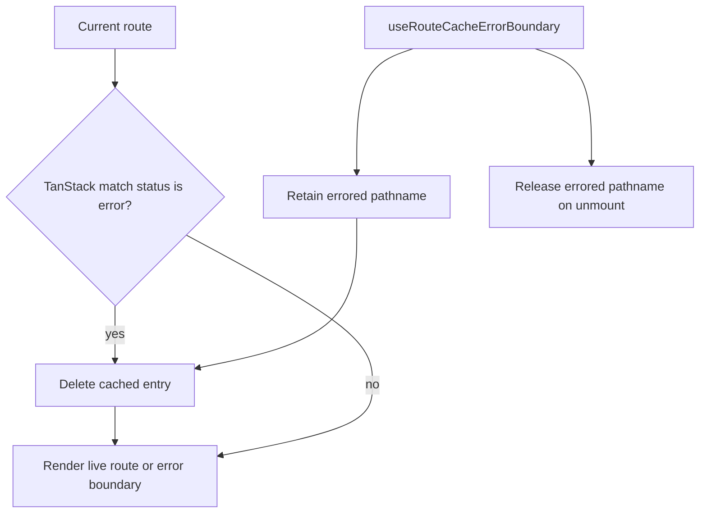

There are two error paths:

- If TanStack Router reports the current match status as `error`, the cache manager deletes that pathname's cached entry.
- If an app-level error fallback calls `useRouteCacheErrorBoundary`, the provider increments an errored count for that pathname and deletes its cached entry until the fallback unmounts.

While a route is errored, the cache manager bypasses its cached outlet and lets the live route or error boundary render.

## Memory model

The package does not clone React component state. It keeps selected route trees mounted and hides them. Memory is bounded by the number and size of cached route trees that remain mounted.

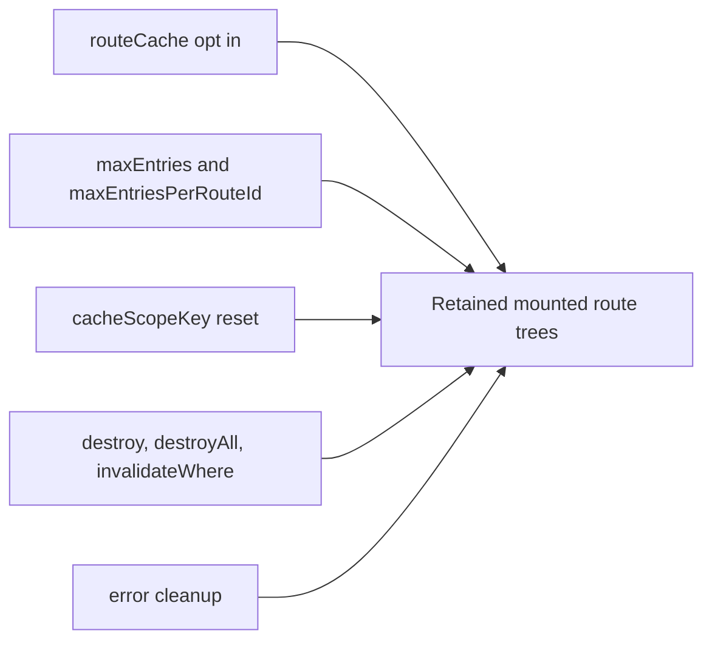

The memory controls are:

- route opt-in through `staticData.routeCache`,
- `maxEntries` for global cache size,
- `maxEntriesPerRouteId` for dynamic routes,
- `cacheScopeKey` for tenant, user, workspace, or environment resets,
- `destroy`, `destroyAll`, and `invalidateWhere` for manual invalidation,
- automatic deletion when a route stops being cacheable or enters an error state.

Dynamic routes are the most important case to bound. For routes such as `/customers/$customerId`, every distinct pathname can retain a separate route tree unless `maxEntriesPerRouteId` or manual invalidation removes older entries.
